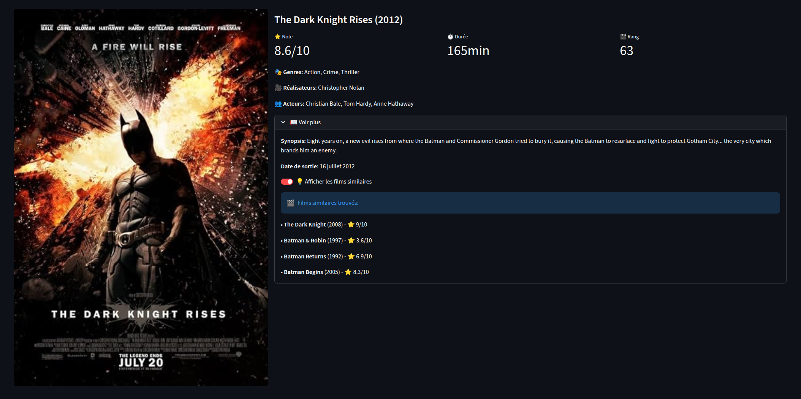
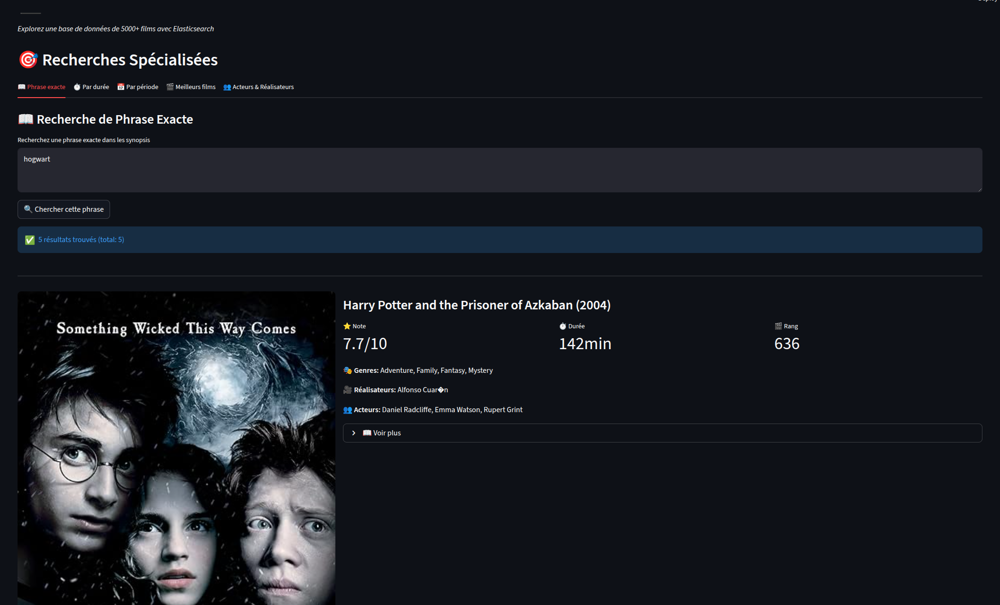
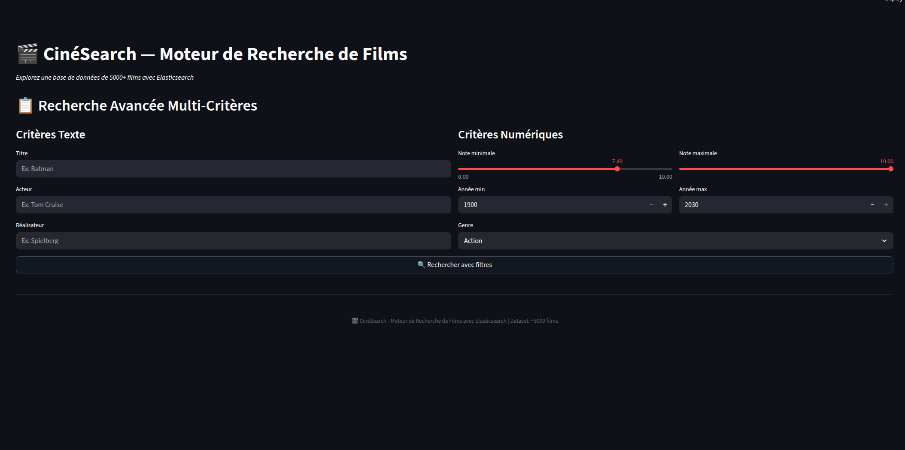
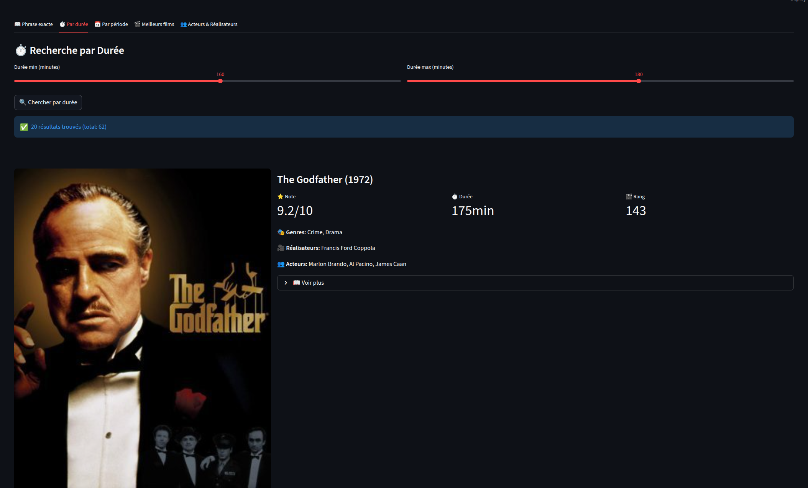
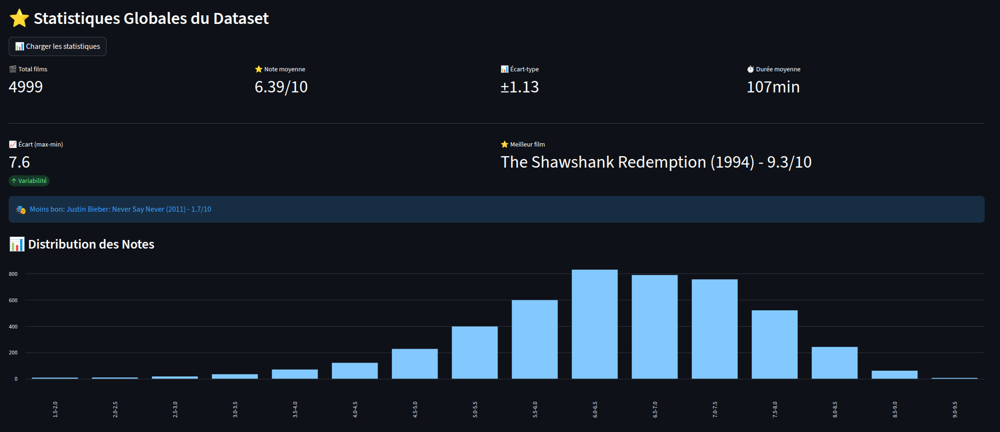
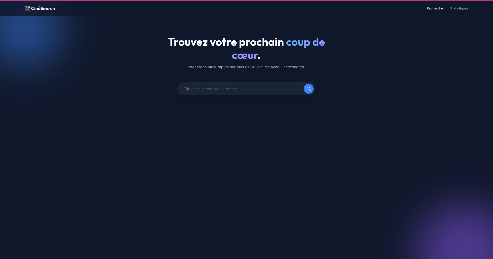
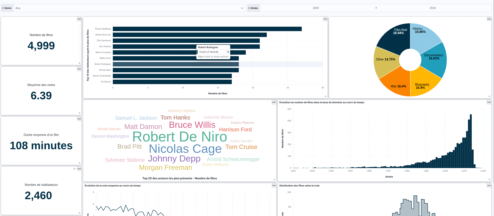

# 🎬 CinéSearch

CinéSearch est un moteur de recherche et d'analyse de films propulsé par **Elasticsearch** et **Python**. Il permet de rechercher, filtrer et analyser un dataset de plus de 5000 films avec des fonctionnalités avancées (recherche full-text, floue, suggestions, système de recommandation par similarité).

Ce projet contient deux interfaces utilisateurs : un tableau de bord analytique sous **Streamlit** et une application Web alimentée par un backend **FastAPI**.

---

## 🛠️ Prérequis

- **Docker** et **Docker Compose** (pour Elasticsearch et Kibana)
- **Python 3.9+**

---

## 🚀 Installation & Démarrage

### 1. Lancer l'infrastructure (Elasticsearch)

Démarrez les conteneurs Elasticsearch et Kibana en arrière-plan à l'aide de Docker Compose :

```bash
docker compose up -d
```
*Patientez quelques secondes que le serveur Elasticsearch soit opérationnel.*

### 2. Configurer l'environnement Python

Créez un environnement virtuel et installez les dépendances :

```bash
# 1. Créer l'environnement virtuel
python -m venv .venv

# 2. Activer l'environnement
# Sur Linux / macOS :
source .venv/bin/activate
# Sur Windows :
# .venv\Scripts\activate

# 3. Installer les dépendances
pip install -r requirements.txt
```

### 3. Indexer les données

Avant de pouvoir rechercher, il faut créer l'index Elasticsearch et y insérer les films depuis le fichier JSON :

```bash
python -m src.indexer
```
*Cette commande va créer l'index, configurer les mappings (analyzers, ngrams pour les suggestions) et injecter les documents via l'API Bulk.*

---

## 🖥️ Utilisation

Le projet propose **trois** façons d'interagir avec les données :

### Option A : Interface Analytique (Streamlit) 
Une interface complète pour la recherche et l'exploration visuelle des données (graphiques interactifs Plotly).
```bash
streamlit run src/app.py
```
*L'application s'ouvrira automatiquement dans votre navigateur.*

### Option B : Application Web (SPA + FastAPI) 
Une architecture web séparant le Backend de l'interface Frontend.

**Étape 1 : Lancer l'API Backend**
```bash
uvicorn src.api:app --reload --port 8001
```

**Étape 2 : Lancer le Frontend** (dans un nouveau terminal)
```bash
cd frontend
python -m http.server 3000
```
*Accédez ensuite à http://localhost:3000 dans votre navigateur pour une expérience dynamique sans rechargement de page.*

### Option C : Ligne de commande (CLI)
Pour une recherche rapide directement dans le terminal :
```bash
python main.py
```

---

## 📊 Kibana

Si vous souhaitez explorer les données manuellement ou créer des tableaux de bord, Kibana est disponible à l'adresse suivante :
👉 **http://localhost:5601**

---

## 🏗️ Architecture et Rôle des Fichiers

Voici le détail de l'architecture du code et le rôle de chaque composant principal :

### `src/indexer.py` (Indexation du json dans Elasticsearch)
C'est le point d'entrée pour la préparation des données. Ses responsabilités incluent :
- **Configuration des mappings et analyzers** : Définition des règles d'analyse de texte (ex: `edge_ngram` pour l'autocomplétion, filtres `lowercase`).
- **Typage des champs** : Distinction entre les champs `text` (pour la recherche full-text) et `keyword` (pour les agrégations exactes comme les réalisateurs ou les genres).
- **Injection bulk** : Utilisation de l'API `helpers.bulk` d'Elasticsearch pour ingérer efficacement les 5000+ films du JSON.
- **Vérification** : Effectue un `refresh` et un contrôle post-indexation pour valider l'intégrité des données importées.

### `src/search.py` (Moteur de recherche)
Cœur de l'application, ce fichier contient toutes les requêtes Elasticsearch. Les différentes fonctions implémentées sont :
- `get_movie_by_id()` : Récupère la fiche détaillée d'un film via son identifiant unique.
- `global_search()` : Recherche globale multi-champs (titre, acteurs, réalisateurs) utilisée par l'interface web.
- `search_by_title()` : **Recherche simple** (Match query) sur le titre exact.
- `search_advanced()` : **Recherche avancée** (Bool query) combinant filtres stricts (date, note, genre) et clauses `must`.
- `search_plot()` : **Recherche full-text** sur les synopsis avec surlignage (`highlight`) des termes trouvés.
- `search_fuzzy()` : **Recherche tolérante aux fautes** de frappe (Fuzziness) très utile pour les noms compliqués.
- `suggest_titles()` : **Autocomplétion** (Prefix query / N-grams) pour suggérer des titres dès les premières lettres tapées.
- `recommend_similar_movies()` : **Moteur de recommandation** (More Like This query) basé sur le texte du synopsis et les genres pour proposer des films à l'ambiance similaire.

### Les autres fichiers Python
- **`src/analytics.py`** : Gère les agrégations (Moyennes, statistiques par décennie, top acteurs/réalisateurs via `bucket_selector`).
- **`src/app.py`** : Interface visuelle en pur Python utilisant la bibliothèque **Streamlit**.
- **`src/api.py`** : Backend Web en **FastAPI** exposant les fonctions de recherche via des routes REST (utilisées pour la version avec le Frontend React-like).

### Arborescence Globale

```text
cinesearch/
├── data/
│   └── movies.json         # Dataset source
├── src/
│   ├── indexer.py          # (Détaillé ci-dessus)
│   ├── search.py           # (Détaillé ci-dessus)
│   ├── analytics.py        # Agrégations et statistiques
│   ├── app.py              # Interface Streamlit
│   └── api.py              # API FastAPI
├── frontend/
│   ├── index.html          # Structure de la SPA
│   ├── style.css           # Design Premium
│   └── app.js              # Logique de navigation asynchrone
├── docker-compose.yml      # Infrastructure (ES + Kibana)
├── requirements.txt        # Dépendances du projet
└── README.md               # Ce fichier
```

---

## 📸 Captures d'écran

Voici un aperçu des différentes interfaces réalisées pour ce projet.

### 1. Interface Streamlit
Le tableau de bord Streamlit utilise la puissance d'Elasticsearch à travers différents onglets et requêtes complexes :

*   **Recherche Globale (`multi_match`)** : Cherche simultanément dans les titres, synopsis, acteurs et réalisateurs avec des pondérations différentes.



*   **Recherche sur l'Intrigue (`match` avec `highlight`)** : Effectue une recherche Full-Text dans le résumé du film et surligne les mots correspondants.



*   **Recherche Tolérante (`match` avec `fuzziness`)** : Permet de trouver des films même avec des fautes de frappe (ex: taper "Batmna" renvoie "Batman").
*   **Recherche Avancée (`bool query`)** : Combine des filtres d'exclusion et d'inclusion stricts (`filter` pour la durée ou les années, `must` pour le texte).



*   **Recommandations (`more_like_this`)** : Un bouton "Films similaires" analyse l'ambiance et les mots-clés du synopsis pour suggérer des œuvres proches.



*   **Statistiques Globales (Agrégations)** : Un onglet dédié permet de visualiser les indicateurs clés du dataset grâce aux agrégations d'Elasticsearch (`avg`, `min`, `max`, `terms`, `histogram`). On y retrouve la note moyenne, la durée moyenne, la répartition par décennie ou encore les genres les plus populaires sous forme de graphiques Plotly interactifs.



### 2. Application Web (React-like / Vanilla JS)
Une single page application entièrement customisée (Dark Mode, Glassmorphism) communiquant de manière asynchrone avec le backend FastAPI.

*   **Recherche Rapide** : Moteur de recherche global ultra-réactif sans rechargement de page.
*   **Pages Détaillées** : Fiches de films immersives avec affiches grand format, métadonnées complètes et films similaires.
*   **Navigation Croisée** : Tags cliquables permettant d'explorer dynamiquement toute la filmographie des acteurs et réalisateurs.
*   **Indicateurs Statistiques** : Un panneau de statistiques affiche instantanément les métriques calculées en direct par Elasticsearch (Total de films, Moyennes globales, Films extrêmes).



### 3. Tableau de bord Kibana
Exploration visuelle des données et des KPI principaux du dataset via des agrégations avancées (Histogrammes, Treemap, Moyennes).
